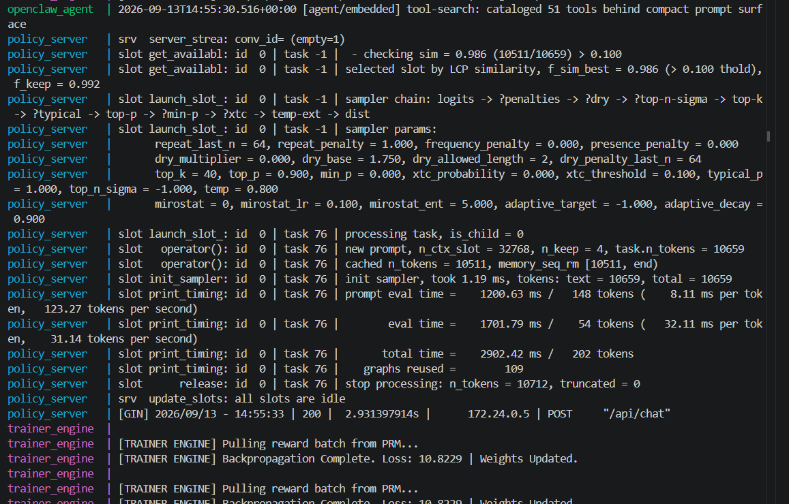

# OpenClaw-RL Local Proof-of-Concept

## 1. Information of the POC
This project is a fully containerized, local Reinforcement Learning (RL) Proof-of-Concept (POC) architecture designed to test the OpenClaw AI agent. It simulates an asynchronous RL loop by decoupling the environment, policy inference, process reward evaluation, and optimization into four isolated microservices. 

The architecture consists of:
*   **Agent Environment (`openclaw-gateway`):** The client interface and workspace sandbox running on port 18789.
*   **Policy Server (`policy_server`):** An Ollama instance serving the `qwen2.5:1.5b` model for local, CPU-friendly inference.
*   **Judge (`prm_server`):** A lightweight FastAPI Process Reward Model (PRM) that evaluates agent actions and assigns scalar rewards.
*   **Optimizer (`trainer_engine`):** A simulated PyTorch LoRA engine that performs asynchronous weight update loops on the CPU.


This is how it is supposed to work
- Agent to Inference: openclaw-gateway successfully points to policy_server over the native HTTP /api/chat route.
- Agent to Judge: openclaw-gateway correctly sends action payloads to the prm_server via the HTTP /evaluate endpoint.
- Optimizer to Judge: trainer_engine accurately shows the asynchronous polling mechanism used to fetch reward signals from the prm_server.


## 2. Scope
**In-Scope:**
*   Demonstrating how OpenClaw connects to a local, offline LLM without exposing API keys to the internet.
*   Verifying tool-calling and workspace manipulation using OpenClaw's native Ollama integration.
*   Simulating an RL pipeline where agent trajectories are scored and passed to an asynchronous gradient optimizer.

**Out-of-Scope:**
*   Production deployment or exposure to the public internet (all ports are bound to `127.0.0.1`).
*   True GPU-accelerated training. The `trainer_engine` uses CPU wheels to simulate backpropagation mathematically without requiring NVIDIA hardware.
*   Handling massive LLMs. The context is constrained, and inference is limited to the 1.5B parameter model to prevent CPU/RAM crashes.

## 3. How to Build

### Prerequisites
*   Windows Subsystem for Linux (WSL2) installed.
*   Docker and Docker Compose v2 running.
*   *(Note for WSL2 users)*: If you encounter an `exec format error`, ensure you remove the `"credsStore": "desktop.exe"` line from your `~/.docker/config.json`.

### Build Steps
1.  Clone or create the project directory and ensure your `.env`, `docker-compose.yml`, and the two mock directories (`mock_prm` and `mock_trainer`) are present as configured.
2.  Open your WSL terminal and navigate to the project root.
3.  Execute the build command to compile the Python images and download the PyTorch/FastAPI dependencies:
    ```bash
    docker compose up -d --build
    ```
4.  Verify all four containers (`openclaw_agent`, `policy_server`, `prm_server`, `trainer_engine`) are running:
    ```bash
    docker compose ps
    ```
5.  Pull the required inference model into the empty Ollama container:
    ```bash
    docker exec -it policy_server ollama pull qwen2.5:1.5b
    ```

## 4. How to Use

### Accessing the Agent
1.  Open your host machine's web browser and navigate to `http://127.0.0.1:18789`.
2.  Authenticate using the `OPENCLAW_GATEWAY_TOKEN` defined in your `.env` file.
3.  In the bottom-right model selector, set the provider to **Ollama** and type `qwen2.5:1.5b` as the model name.
4.  Click the shield icon (Read-Only mode) in the prompt box and change it to allow workspace execution. 

### Monitoring the RL Loop
Because the architecture runs asynchronously, you must tail the logs of the individual containers to see the system working in real-time. Open a new terminal and run these commands to watch the pipeline:

*   **To watch the agent interact with the workspace:**
    ```bash
    docker logs -f openclaw_agent
    ```
*   **To watch Ollama process the context window and tokens:**
    ```bash
    docker logs -f policy_server
    ```
*   **To watch the PRM Judge evaluate actions and assign scores (+1.0 / -1.0):**
    ```bash
    docker logs -f prm_server
    ```
*   **To watch the Trainer Engine calculate PyTorch gradients on the CPU:**
    ```bash
    docker logs -f trainer_engine
    ```


## First Results

The chat does not go very well; we can see the responses are bad


but we do prove that we have an online training

